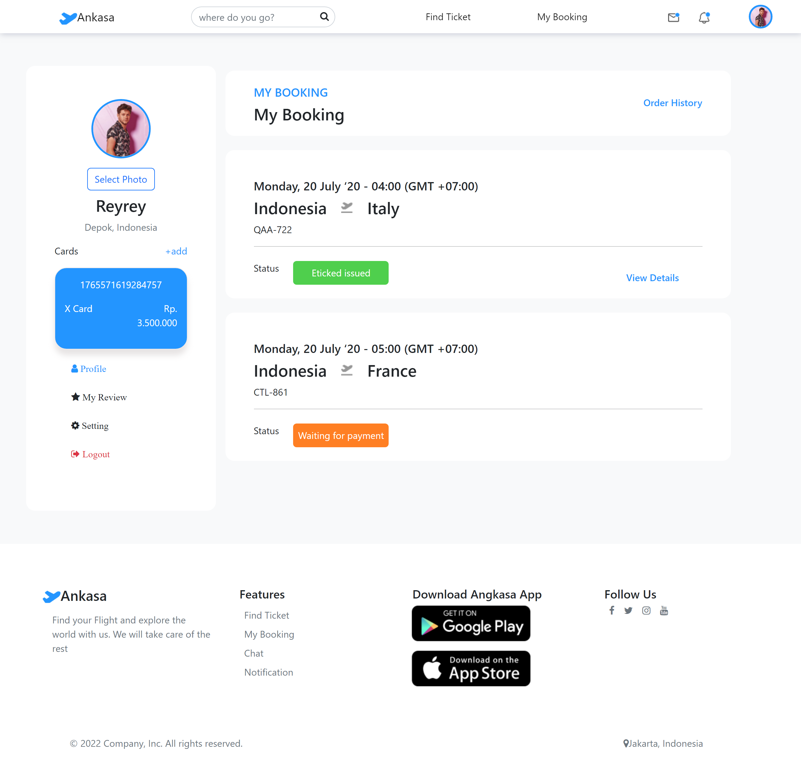
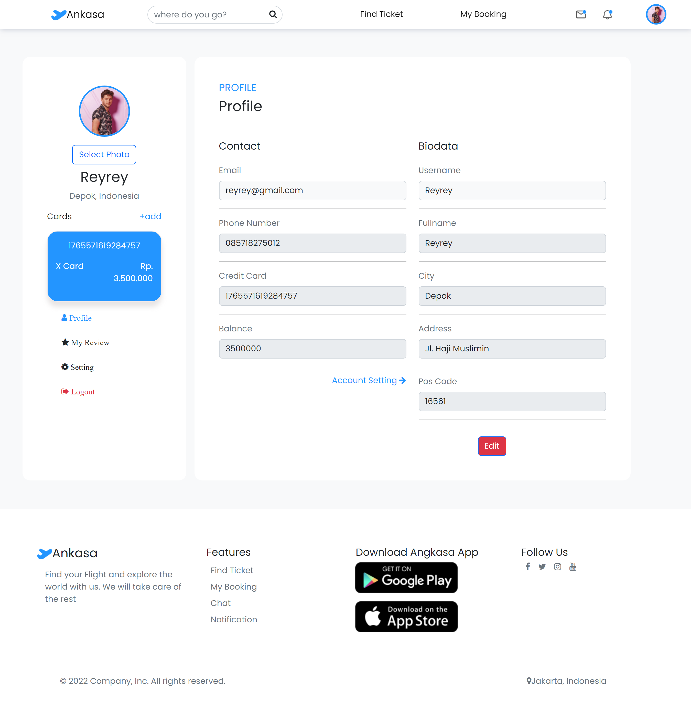

<br />
<p align="center">

  <h3 align="center">Ankasa Ticketing</h3>
  <p align="center">
    <image align="center" width="400" src='./public/ankasa_logo.png' />
  </p>
  <p align="center">
    <a href="https://ankasa-nightlabs.vercel.app">View Demo</a>
  </p>
</p>


<!-- TABLE OF CONTENTS -->
## Table of Contents

* [About the Project](#about-the-project)
  * [Project Structure](#project-structure)
  * [Screenshots](#screenshots)
  * [Package Modules](#package-modules)
* [Getting Started](#getting-started)
  * [Prerequisites](#prerequisites)
  * [Installation](#installation)
* [Contributing](#contributing)
* [Related Project](#related-project)
* [Contact](#contact)


<!-- ABOUT THE PROJECT -->
## About The Project


Ankasa Ticketing is an application that allows users to find and order airline tickets. Ankasa Ticketing application will give all information about any airline available and any facilities that is provided. Users are able to find flight detail and book the flight. The application will calculate whether the user's balance is enough or not to complete the booking payment. If the user's balance is not enough, the booking status will be unpaid and user will need to complete the payment later. Users are able to edit their profile status in the profile page.


### Project Structure
```
|── AnkasaAPP
   |── public          # Public Assets
   |── screenshot      # Screenshots of the application
   |── src             # Project source code
       |── assets      # Application assets
       |── Components  # Application components
       |── pages       # Pages source code
       |── redux       # State management
       |── router      # Endpoint
   |── .env            # Environment variables   
   |── .gitignore      # Files that should be ignored
   |── README.md       # Readme
```

### Screenshots
<details>
  <summary>
    Login Page
  </summary>

</details>

<details>
  <summary>
    Register Page
  </summary>

</details>

<details>
  <summary>
    Forgot Password Page
  </summary>

</details>

<details>
  <summary>
    Reset Password Page
  </summary>

</details>

<details>
  <summary>
    Landing Page
  </summary>

</details>

<details>
  <summary>
    Flight Search Page
  </summary>

</details>

<details>
  <summary>
    Flight Detail Page
  </summary>

</details>

<details>
  <summary>
    MyBooking Page
  </summary>

</details>

<details>
  <summary>
    Booking Detail Page
  </summary>

</details>

<details>
  <summary>
    Profile Page
  </summary>

</details>

<details>
  <summary>
    Admin Login Page
  </summary>

</details>

<details>
  <summary>
    Admin Landing Page
  </summary>

</details>

<details>
  <summary>
    Admin Airline Search Page
  </summary>

</details>

<details>
  <summary>
    Admin Insert Airline Page
  </summary>

</details>

<details>
  <summary>
    Admin Update Airline Page
  </summary>

</details>

<details>
  <summary>
    Admin Flight Search Page
  </summary>

</details>

<details>
  <summary>
    Admin Insert Flight Page
  </summary>

</details>

<details>
  <summary>
    Admin Update Flight Page
  </summary>

</details>

### Package Modules

Below are lists of modules used in this application:

* [React JS](https://reactjs.org/)
* [Bootstrap](https://getbootstrap.com/)
* [jQuery](https://jquery.com/)
* [Redux](https://redux.js.org/)
* [Dotenv](https://www.npmjs.com/package/dotenv)


<!-- GETTING STARTED -->
## Getting Started

### Prerequisites

This is an example of things you need to use the application and how to install them.

* [node.js](https://nodejs.org/en/download/)


